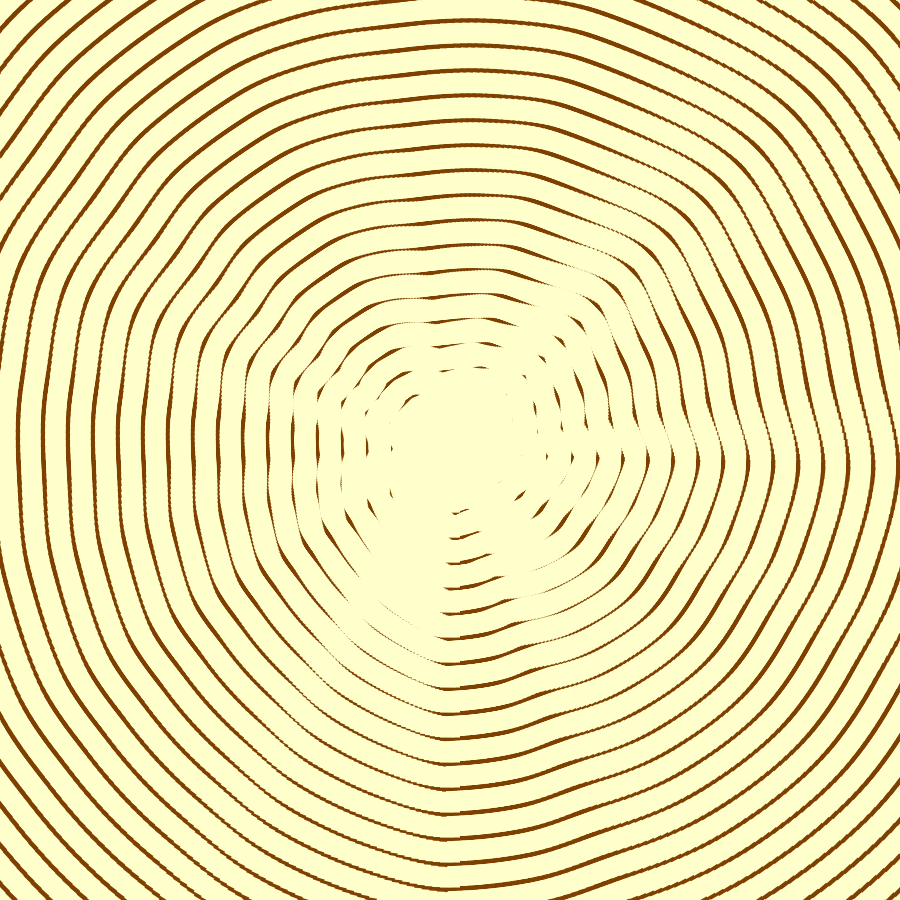
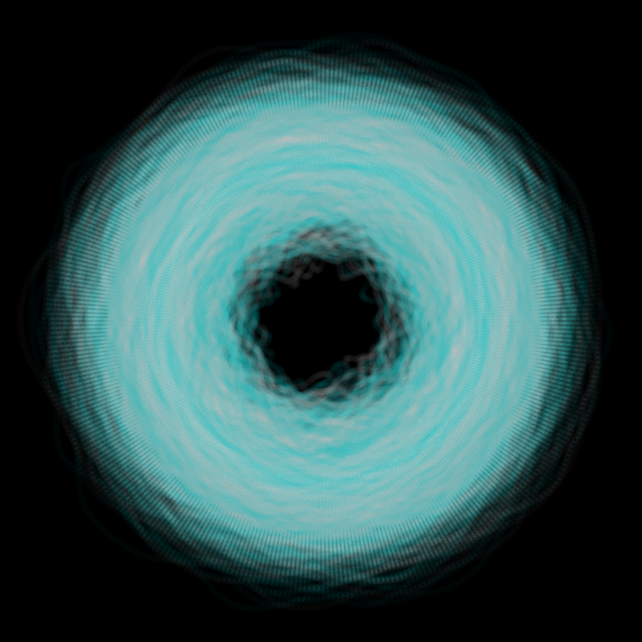
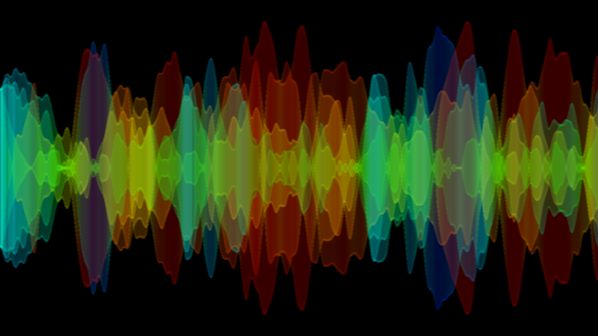
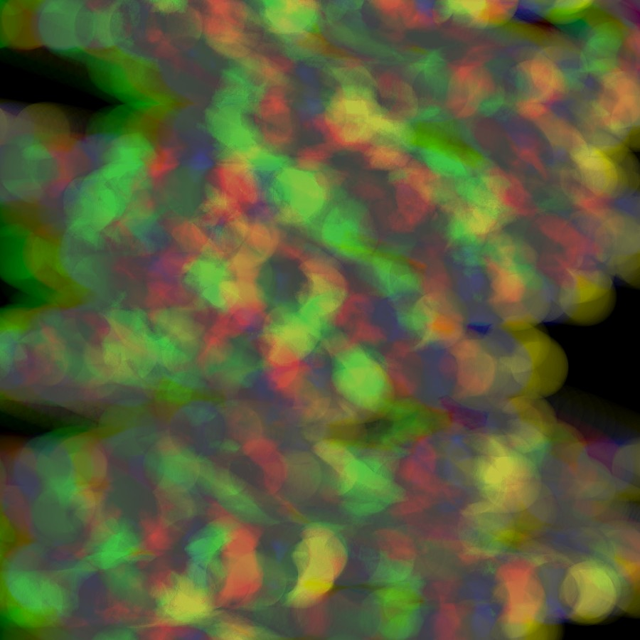
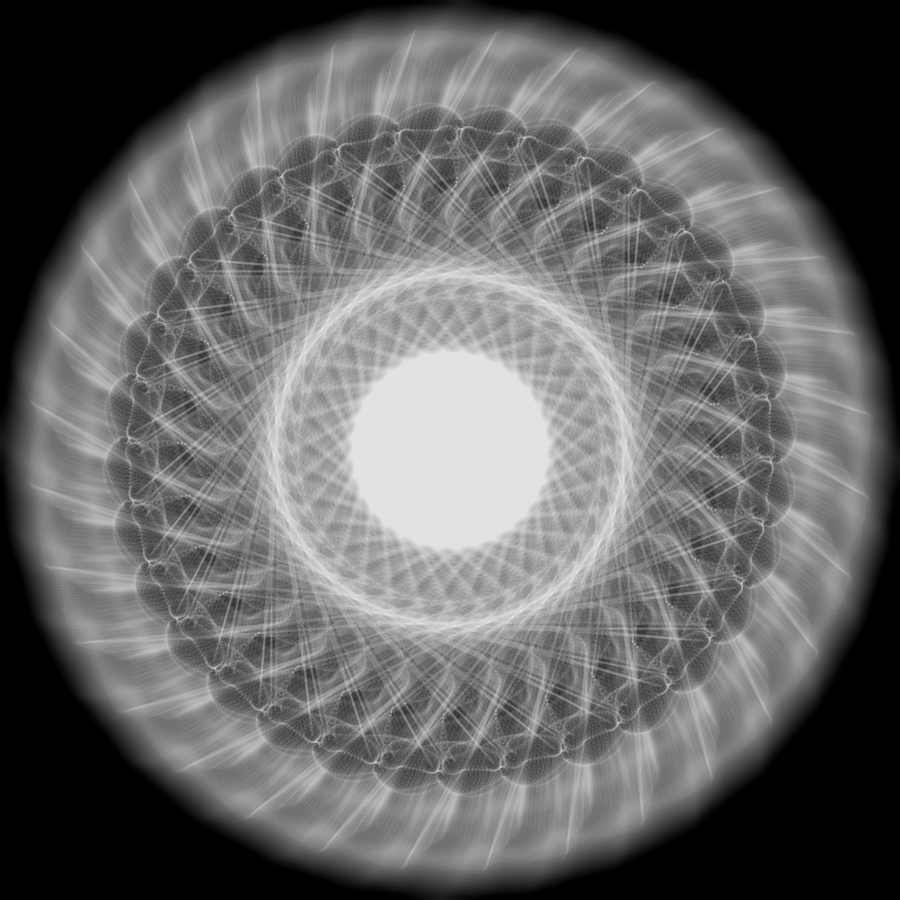

# daily-coding-challenge

ohayota's creative coding ( 2020.04.01 - 2020.05.14 )

***

2020.04.01「遠ざかる」[NEORT作品ページ](https://neort.io/art/bq30ekc3p9fefb9276q0)

***

2020.04.02「見えない壁」

***

2020.04.03「リアルタイム」

***

2020.04.04「破裂」

***

2020.04.05「マイナーコード」

***

2020.04.06「とける」

***

2020.04.07「情緒の振動」

***

2020.04.08「ストロボ」

***

2020.04.10「虹吹雪」

***

2020.04.22「年輪」

***

2020.04.29「電気ドーナツ」

***

2020.05.03「ミラーウェーブ」

***

2020.05.05「サーチライト」

***

2020.05.07「雲行き」

***

2020.05.14「Fluff」

